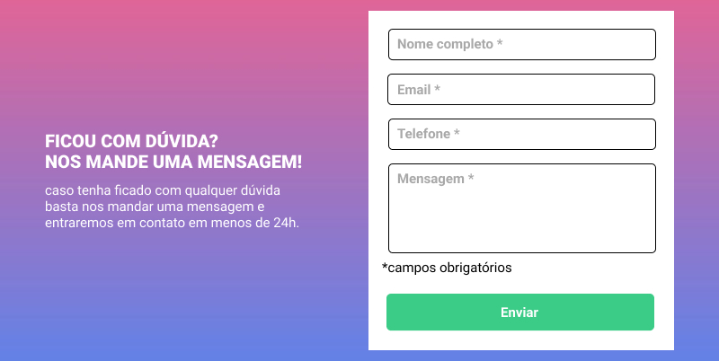
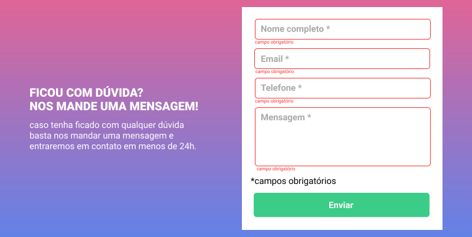

# Desafio Formulário com Validação

    este foi um desafio proposto pelos professores do Curso Dev Quest onde o objetivo era criar um Formulário com validação de preenchimento por meio de JS.

- Layouts de Referência

